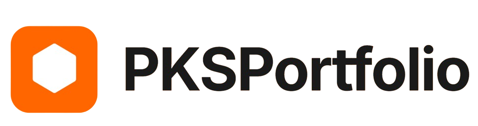

<p align="center">
  
</p>

<h1 align="center">🚀 PKS Portfolio Website</h1>

<p align="center">
  A modern, responsive, and animation-rich personal portfolio showcasing projects, skills, and certifications.
</p>

<p align="center">
  <a href="https://pavannsshetty7022.github.io/portfolio-website">
    
  </a>
  <a href="https://github.com/pavannsshetty7022/portfolio-website">
    
  </a>
  <a href="https://github.com/pavannsshetty7022">
    
  </a>
</p>

---

## 🛠️ Core Technologies

| Technology | Purpose |
|----------|--------|
| **HTML5** | Structural foundation of the website |
| **CSS3 (Vanilla CSS)** | Advanced styling, layout control, and UI effects |
| **JavaScript (ES6+)** | Interactivity, animations, and library initialization |

### 🎨 CSS Highlights
- **Glassmorphism UI** using `backdrop-filter`
- **CSS Variables** for Dark/Light theme management
- **Flexbox & CSS Grid** for responsive layouts

---

## 📦 Frameworks & CSS Libraries

- **Bootstrap 5.3.3**  
  Responsive grid system, navbar, cards, utilities, and interactive components like Toasts.
- **Hover.css**  
  Elegant CSS-powered hover animations (e.g., underline-from-center effects).

---

## 🚀 JavaScript Libraries & APIs

| Library | Usage |
|------|------|
| **GSAP** | High-performance animations |
| **ScrollTrigger (GSAP Plugin)** | Scroll-based section reveals and animation timing |
| **Lenis** | Smooth, inertia-based scrolling experience |
| **Typed.js** | Typing animation in the hero section |
| **EmailJS** | Client-side email sending from contact form |
| **Swiper.js** | Touch-enabled sliders (future extensibility) |

---

## 🎨 Fonts, Icons & Assets

- **Google Fonts – Inter**  
  Clean, modern typography
- **Bootstrap Icons**  
  UI icons, social links, navigation
- **Devicon**  
  Technology icons for skills section
- **Skill Icons (skillicons.dev)**  
  Dynamic and themed skill visuals

---

## 🔧 Tools & Features

- **LocalStorage API**  
  Persists Dark / Light theme preference
- **Responsive Design**  
  Fully mobile-first and desktop-friendly
- **Performance Optimizations**
  - Lazy loading images
  - Non-blocking scripts
- **Scroll-based Navbar Tracking**
- **Animated Marquee Text**
- **Toast Notifications for Form Feedback**

---

## 📂 Project Structure

```bash
portfolio-website/
│
├── Assets/            # Images, icons, illustrations
├── certificates/      # Certification images
├── projects/          # Project screenshots
│
├── index.html         # Main HTML file
├── style.css          # Global styling
├── script.js          # JavaScript logic
└── README.md          # Project documentation
